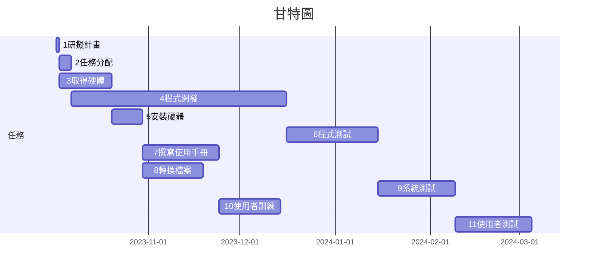

# PERT圖

# 甘特圖

```mermaid
gantt
    title 甘特圖

    section 任務
    1研擬計畫     :p1, 2023-10-02, 1d    
    2任務分配     :p2, after p1,4d
    3取得硬體     :p3, after p1, 17d
    4程式開發     :p4, after p2, 70d
    5安裝硬體     :p5, after p3, 10d
    6程式測試     :p6, after p4, 30d
    7撰寫使用手冊 :p7, after p5, 25d
    8轉換檔案     :p8, after p5, 20d
    9系統測試     :p9, after p6, 25d
    10使用者訓練   :p10, after p7, 20d
    11使用者測試   :p11, after p9, 25d
```
---
# 關鍵路徑
